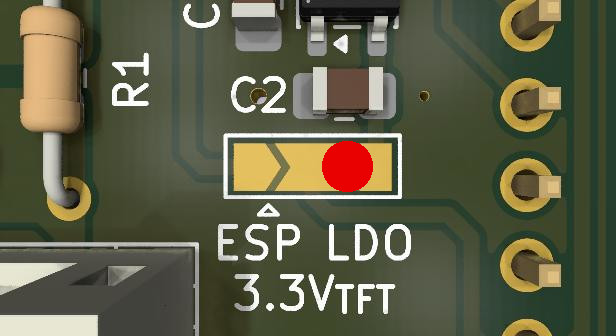
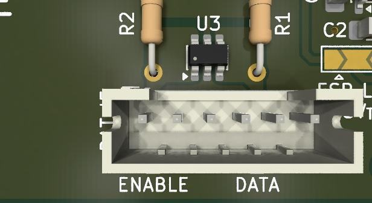
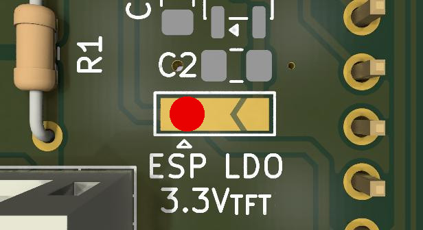

# PocketOBI — Alternative PCB

This directory contains material for producing an alternative PCB version with some optional additions. One option is to include an additional linear voltage regulator for the TFT screen and the backlight. There is the option to add ESD protection for the `DATA` and `ENABLE` line. It also allows to use 0603 SMD resistors instead of THT. Theoretically, the ESP32-C3 SuperMini could also be mounted SMD style, but this requires modifying the case due to the changed position of the USB type C connector.

## Bill of Materials

|Designator|Option|Item|Value|Quantity|Notes|
|----------|------|----|-----|--------|-----|
|C1, C2|1|Capacitor 0805|10µF 16V|2||
|J1||Pin Header|12 pins, 2.54 mm pitch, vertical|1|`TFT-Enc`|
|J2||Connector JST PH B6B-PH-K|1x06 pins, 2.00mm pitch, vertical|1|`BAT_IF`|
|J3||Screw Terminal KF301|5.08 or 5.0 mm pitch|1|`BAT_GND`|
|R1, R2||Resistor axial, DIN0207 THT or 0603 SMD|1k|2||
|U1||ESP32C3-SuperMini|including pin headers|1||
|U2|1|3.3V Voltage Regulator (LDO), SOT-23|__many alternatives:__ 662K, XC6206, RT9193-33G, AP2127N-3.3, MCP1700-3302E/TT, ME6206A33M3G, ME6209A33M3G, or similar|1||
|U3|2|ESD Protection TVS Array, SOT-23-6|USBLC6-2SC6|1||

### Options
- __Option 1__: Additional LDO for supplying the TFT and the backlight, requires fitting C1, C2, and U2. Please put a solder blob on the __right half__ of the solder jumper to connect the middle pad and right `LDO` pad. The __left `ESP` pad__ needs to __remain unconnected__. 

- __Option 2__: ESD protection for the `DATA` and `ENABLE` line (battery interface), requires fitting U3.

When you __do not want to install an additional LDO (no option 1)__, please put a solder blob on the __left half__ of the solder jumper to connect the left `ESP` pad and the middle pad.

## License

This PCB was developed by @ksjh independently of @TheRepairforge.

Please see the `LICENSE` file in this directory for licensing information.